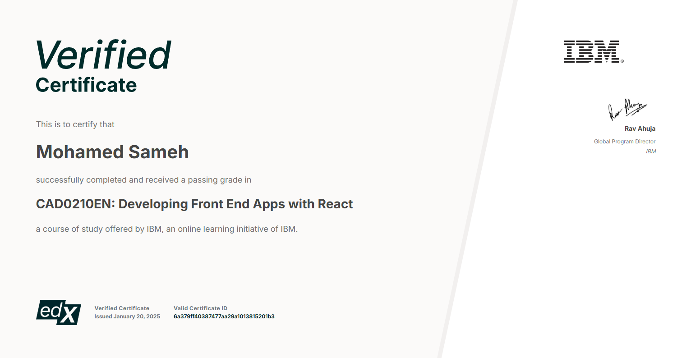

# 🛒 Shopping Cart Web Application

## 📜 Certificate



## 🌟 Project Overview
This **Shopping Cart Web Application** is the final project for IBM's _Developing Front-End Apps with React_ course. The project showcases the foundational skills of front-end development, including:

- ✨ **Manipulating the DOM** dynamically to reflect user interactions.
- 📊 **Mathematical and visual updates** in real time as users add, remove, or modify items in the cart.
- 🔄 Seamless state management using **React Redux** for an optimized and scalable application.

## 🧑‍💻 Features
- **Add to Cart**: Easily add products to your shopping cart.
- **Update Quantity**: Increase or decrease item quantities directly in the cart.
- **Remove Items**: Remove items from the cart with a single click.
- **Real-Time Updates**: Display accurate cart totals and changes instantly.
- **Responsive Design**: The app works beautifully across devices.

## ⚙️ Tech Stack
- **React**: For building dynamic and reusable UI components.
- **React Redux**: For state management, ensuring a predictable and centralized data flow.
- **CSS**: For a sleek and responsive design.


## 🛠️ How to Run the Project
1. Clone the repository:
   ```bash
   git clone <repository-url>
   ```
2. Navigate to the project directory:
   ```bash
   cd shopping-cart-app
   ```
3. Install dependencies:
   ```bash
   npm install
   ```
4. Start the development server:
   ```bash
   npm start
   ```
5. Open your browser and navigate to:
   ```
   http://localhost:3000
   ```


## 🤝 Acknowledgments
A huge thank you to IBM and the instructors of the _Developing Front-End Apps with React_ course for their guidance and resources! 🙌

---

### 🌐 Connect
If you have any feedback or suggestions, feel free to reach out or open an issue. Let’s make this project even better together! 💬

